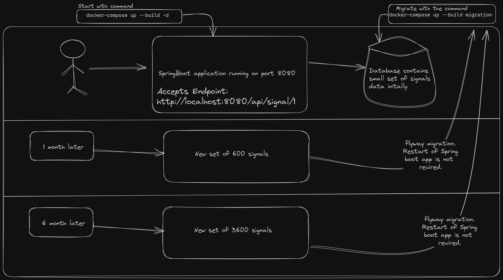

# Trading Signals Service

This is a Spring Boot application that acts as a service for handling trading signals. It receives trading signals via an HTTP API and processes them based on pre-configured steps. The steps for each signal type are stored in a MySQL database and can be easily updated or extended.

The reasoning behind considering this approach is explained here
[Reason](Why.md)


```bash
    Please ignore the minor typo of "required" being misspelled in the diagram.
```
## Requirements

- Java 11
- Docker Desktop

## Features

- **Receive Signals via HTTP API**: The application exposes an HTTP endpoint that accepts trading signals as an integer in the path. 
- **Configurable Signal Processing**: The processing steps for each signal type are stored in a MySQL database, allowing for easy updates and additions of new signal types.
- **Automatic Initial Data Loading**: The application automatically loads initial signal configurations from `schema.sql` and `data.sql` files at startup.
- **Exception Handling**: The application includes exception handling to provide user-friendly error messages when an invalid signal type is received.

## List of to-do's
1. ~~Initialise the Springboot application.~~ - Done
2. ~~Create the Controller, service, data flow~~ - Done
3. ~~Write unit tests for service and integration tests for the application~~ - Done
4. ~~Docker-compose the application with MySQL and Springboot application~~ - Done
5. ~~Support fot the new signals through migration~~ - Done
6. Run test before the migration happens - todo
7. Support for github actions to merge the branch to master/main only when tests are successful - todo
8. Provide basic security - todo
9. Follow Hexagonal clean code architecture - todo
10. Add caching to avoid multiple Database call - todo
## Running the Application

Before running the application, make sure you have Docker Desktop installed on your machine. The application is packaged as a Docker image and uses Docker Compose to run together with a MySQL database.

To run the application, follow these steps:

1. Clone the repository to your local machine.
2. Navigate to the project root directory in your terminal.
3. Make sure the ports 8080 and 3307 are available.
4. Build the Docker images and start the services using Docker Compose:

    ```bash
    docker-compose up -d --build
    ```

    This command will build the Docker images for the application and the MySQL database, and start the services. The application will be accessible at `http://localhost:8080`.

## API Endpoints

- **Receive Signal**: `GET /api/signal/{signalType}`

    This endpoint receives a trading signal as a path variable. Replace `{signalType}` with the integer representing the signal type.
  
- **Example to try this on the Browser/Postman/Curl**: http://localhost:8080/api/signal/1

## Support for the new signals 

1. Navigate to the db/migration folder.
2. Create a new file in the correct format: `V<VERSION>__<DESCRIPTION>.sql` 
3. The `<VERSION>` is a version number that is used to determine the order in which the scripts are run. 
4. The `<DESCRIPTION>` is a brief description of what the script does.
5. Example: `V1__Add_signal_configuration.sql`
6. After adding the correct `INSERT` statement in the SQL run the command
    ```bash
    docker-compose up --build migration
    ```
## Notes

- The Docker Compose configuration is set to automatically restart the services if they go down. If you want to stop the services, use the following command:

    ```bash
    docker-compose down
    ```

- If you make changes to the application code and want to run the updated application, you need to rebuild the Docker images using the `docker-compose up --build` command.
- Add `-d` flag to run in the background. (Deamon runs in the background) 
- The application uses Hibernate to automatically create the database schema based on the entity classes. If you want to modify the database schema, you can do so in the `schema.sql` file. However, you need to disable Hibernate's automatic schema creation by setting `spring.jpa.hibernate.ddl-auto=none` in the `application.properties` file.

- The `schema.sql` and `data.sql` files are executed at startup to create the database schema and insert initial data. If you want to add or modify the initial data, you can do so in the `data.sql` file.

